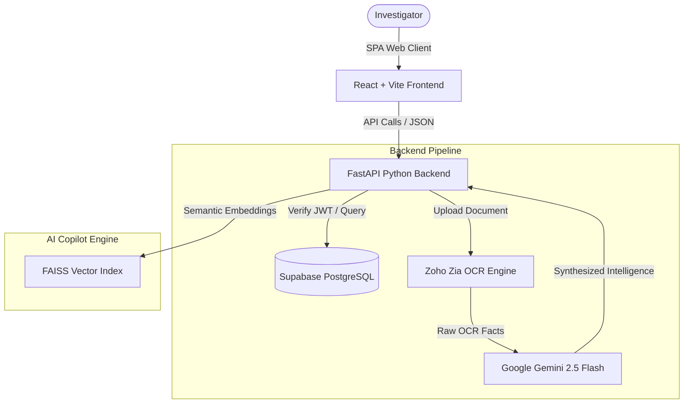

# 🔍 CrimeLens AI — Advanced Forensic & Case Intelligence Management System

**CrimeLens AI** is a state-of-the-art cognitive investigation dashboard designed for law enforcement agencies (e.g. Karnataka State Police) to ingest unstructured evidence files (FIRs, statements, case diaries), synthesize forensic intelligence, analyze suspect network graphs, and map geographical crime density patterns.

---

## 🌟 Feature Highlights

*   **⚡ AI-Powered Evidence Extraction (Zia + Gemini):** Automatically runs Zoho Zia OCR on uploaded evidence files (images/PDFs) to extract raw text and uses Google Gemini 2.5 Flash to synthesize structured intelligence (entities, weapons, locations, timelines, and case briefs).
*   **📍 Crime Density Heatmaps:** Real-time geospatial mapping of crime heads and hotspots using Leaflet and React Map to visualize crime hotspots.
*   **🕸️ Forensic Network Link Explorer:** Interactive node-link graph mapping connections between cases, accused persons, and locations to discover hidden accomplice patterns.
*   **💬 Investigator AI Copilot:** Instant database queries, case briefings, smart draft documents (chargesheets, lookouts), and next-step recommendations through a dynamic conversational voice & chat interface.
*   **🔒 Secure Supabase Auth:** Robust JWT token authentication system backed by Supabase PostgreSQL connection pooler.
*   **🐳 Zoho Catalyst Ready:** Optimized configuration with `app-config.json` for lightweight containerization on AppSail.

---

## 🏗️ System Architecture



---

## 📂 Repository Structure

```text
├── backend/
│   ├── app/
│   │   ├── api/v1/          # FastAPI routes (auth, cases, heatmap, intelligence, etc.)
│   │   ├── core/            # Configuration management
│   │   ├── db/              # SQLAlchemy sessions
│   │   ├── models/          # Database ORM models
│   │   └── services/        # AI orchestration (ZiaService, GeminiService)
│   ├── configs/             # Application environment configurations
│   ├── create_admin.py      # Database seeding scripts
│   ├── index.py             # Uvicorn entry point
│   ├── requirements.txt     # Python requirements
│   └── app-config.json      # Zoho Catalyst deployment configurations
├── frontend/
│   ├── src/
│   │   ├── components/      # UI components (dashboard, network explorer, heatmaps, cases)
│   │   ├── pages/           # Screen views (Dashboard, Cases, Chat, Heatmap)
│   │   ├── services/        # Frontend API layer
│   │   └── index.css        # Tailwind styling root
│   ├── package.json         # Node scripts & dependencies
│   └── vite.config.ts       # Vite config
├── shared/                  # Common resources
└── Dockerfile               # Root backend Docker builder
```

---

## 🚀 Getting Started

To get started quickly, please refer to the detailed instructions in [SETUP.md](file:///e:/desk/crimelens/SETUP.md).

### Quick Local Dev Start:

1.  **Backend:**
    ```bash
    cd backend
    pip install -r requirements.txt
    python create_admin.py
    python seed_data.py
    uvicorn app.main:app --reload
    ```
2.  **Frontend:**
    ```bash
    cd frontend
    npm install
    npm run dev
    ```

---

## 🛡️ License

This project is proprietary and confidential. Created for Karnataka State Police Digital Hackathon.
