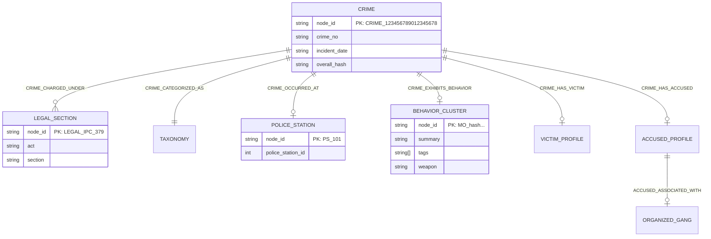

# CrimeLens Knowledge Graph Domain Model (Spec v1.0)

This document defines the canonical domain representation of the CrimeLens Knowledge Graph. It abstracts the deeply nested `CrimeSignatureV2.1` into an interconnected network of nodes and edges, ready for persistence in any graph database (e.g., Neo4j, Neptune) or in-memory analysis.

## 1. Design Philosophy
The Knowledge Graph does not store massive unstructured texts. It acts as an index of semantic relationships. By treating cryptographic hashes (like `behavior_hash`) as Node Identifiers, disparate crimes that share identical MOs automatically cluster together in the graph without requiring explicit vector similarity searches.

## 2. Entity Relationship Diagram

## 3. Node Definitions

| Entity Class | Primary Identifier (`node_id`) | Description |
|---|---|---|
| **CrimeNode** | `CRIME_{crime_no}` | The central entity representing a distinct FIR. |
| **PoliceStationNode** | `PS_{police_station_id}` | Jurisdictional entity. Connects spatial crimes. |
| **TaxonomyNode** | `TAX_{taxonomy_hash}` | Categorical grouping (e.g., 'THEFT - MOTOR VEHICLE'). |
| **LegalSectionNode** | `LEGAL_{act}_{section}` | Distinct penal code sections (e.g., 'IPC 379'). |
| **BehaviorNode** | `MO_{behavior_hash}` | A cluster node representing an identical Modus Operandi execution. Highly connected. |
| **VictimNode** | `VICTIM_PROFILE_{victim_hash}` | The demographic profile of victims targeted in a crime. |
| **AccusedNode** | `ACCUSED_PROFILE_{accused_hash}`| The profile of the accused perpetrators. |
| **GangNode** | `GANG_{spatial_hash_prefix}` | Derived node indicating an organized network operating in a specific spatial cluster. |

## 4. Relationship Definitions

| Edge Type | Source -> Target | Weight / Confidence | Notes |
|---|---|---|---|
| `CRIME_OCCURRED_AT` | Crime -> PoliceStation | 1.0 / 1.0 | Fixed geographical mapping. |
| `CRIME_CATEGORIZED_AS` | Crime -> Taxonomy | 1.0 / 1.0 | Fixed hierarchical mapping. |
| `CRIME_CHARGED_UNDER` | Crime -> LegalSection | 1.0 / 1.0 | Can have multiple edges per crime. |
| `CRIME_EXHIBITS_BEHAVIOR` | Crime -> Behavior | `behavior_confidence` | Relies on NLP extraction confidence. |
| `ACCUSED_ASSOCIATED_WITH` | Accused -> Gang | `intelligence_confidence` | High-value derived edge bridging separate accused profiles to a hidden network. |

## 5. Downstream Consumers

1. **Criminal Network Explorer**: Queries the graph to find hidden gang links. By traversing `Crime -> Accused -> Gang -> Accused -> Crime`, investigators can link isolated incidents to a centralized organization.
2. **Investigator Copilot**: Uses graph traversal to rapidly answer questions like *"What other crimes used IPC 379 and a Knife in this PS jurisdiction?"*
3. **Pattern Detection**: Uses centrality algorithms (like PageRank on `BehaviorNode`s) to identify sudden spikes in specific MOs across multiple districts.
