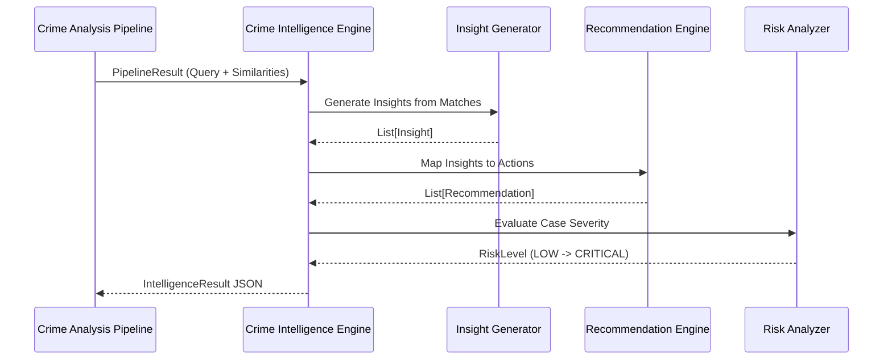

# CrimeLens AI — Crime Intelligence Engine

The Crime Intelligence Engine is the terminal stage of the CrimeLens AI ML inference pipeline. Its sole purpose is to convert raw numerical similarity scores and feature vectors into **human-readable, actionable investigative intelligence**.

> [!IMPORTANT]
> The engine operates entirely deterministically. It does NOT utilize Generative AI, external LLM calls, or probabilistic text generation. Every generated insight and recommendation is tied mathematically to the presence of specific matched features. This guarantees 100% explainability.

## Architectural Flow

## Core Modules

### 1. Insight Generator
Scans the frequency and density of `matched_features` across all returned candidate cases.
* **Temporal Pattern**: Identifies cyclical timing overlaps.
* **Spatial Pattern**: Locates Geohash clustering bounds.
* **Organized Crime Indicator**: Flags correlations involving strict Crime Head matches coupled with identical behavioral execution vectors.

### 2. Recommendation Engine
Translates extracted patterns into prescriptive next steps for the investigating officer. For example, a `Temporal Pattern` triggers a priority action to "Verify CCTV footage during matching time window."

### 3. Risk Analyzer
Computes a dynamic case threat level from `LOW` to `CRITICAL` based on the overall confidence threshold and the presence of severe indicators (e.g. Organized Crime rings).
