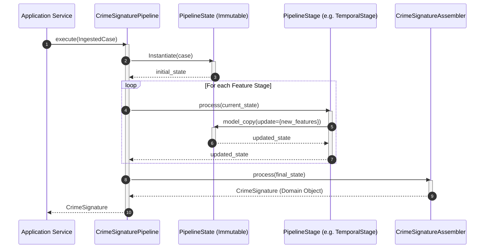

# Crime Signature Pipeline Framework

This package contains the core Machine Learning Pipeline Framework for CrimeLens AI, which processes raw `IngestedCase` models into canonical, immutable `CrimeSignature` domain objects.

---

## 1. Architectural Diagram

The diagram below shows how the stages are sequenced to construct the `CrimeSignature` object:

```
  [ IngestedCase ]
         │
         ▼
 ┌───────────────┐
 │  Pipeline     │
 │  Runner       │
 └───────┬───────┘
         │ Iterates over registered stages
         ▼
 ┌───────────────────────────────────────────────┐
 │ 1. ValidationStage                            │ ──► Asserts required inputs are present
 ├───────────────────────────────────────────────┤
 │ 2. NormalizationStage                         │ ──► Standardizes facts narrative text
 ├───────────────────────────────────────────────┤
 │ 3. StructuredFeatureStage                     │ ──► Mapped categories and charges
 ├───────────────────────────────────────────────┤
 │ 4. TemporalFeatureStage                       │ ──► Encodes cyclical hour and days
 ├───────────────────────────────────────────────┤
 │ 5. SpatialFeatureStage                        │ ──► Encodes Geohash and region zones
 ├───────────────────────────────────────────────┤
 │ 6. BehavioralFeatureStage                     │ ──► Parses MO keywords and history
 ├───────────────────────────────────────────────┤
 │ 7. TextFeatureStage                           │ ──► Prepares text narrative vector slots
 ├───────────────────────────────────────────────┤
 │ 8. CrimeSignatureAssembler                    │ ──► Compiles the final signature
 └───────────────────────┬───────────────────────┘
                         │
                         ▼
                 [ CrimeSignature ]
```

---

## 2. Sequence Diagram

The sequence of state transitions across the pipeline:



---

## 3. Design Decisions & Architectural Log

### A. The Pipeline Pattern (Open-Closed Principle)
Instead of processing case data in a single massive script, we decompose feature extraction into discrete, single-responsibility blocks called **stages**. Every stage implements a common `PipelineStage` interface.
* **Benefit**: You can add new feature extractors (e.g. a `SocialNetworkGraphStage` or `VehicleLicensePlateStage` in future phases) by writing a new class and registering it, without changing the pipeline runner.

### B. Functional State Transitions & Immutability
Every stage takes an input state and returns a new state. The `PipelineState` model uses Pydantic V2’s `frozen=True` configuration.
* **Benefit**: Guarantees that stages do not have side effects. It makes the pipeline thread-safe, prevents race conditions, and simplifies unit testing.

### C. Pure Python Spatial Processing
To prevent build errors during local development on Windows and compilation issues on Zoho Catalyst AppSail, geohashing is implemented as a pure-Python base32 partition algorithm rather than relying on binary-compiled geohash C extensions.

### D. Cyclical Temporal Calculations
Simple hour numbers (e.g., 23:59 vs. 00:01) fail distance checks. We map hours and weekdays to circular space coordinates using sine and cosine functions:
$$\text{Hour}_{\sin} = \sin\left(\frac{2\pi \cdot \text{hour}}{24}\right), \quad \text{Hour}_{\cos} = \cos\left(\frac{2\pi \cdot \text{hour}}{24}\right)$$
This ensures that late-night crimes are placed close to early-morning crimes in vector calculations.

---

## 4. Registering a Custom Stage

You can register a custom stage dynamically:

```python
from app.services.crime_signature.core.interfaces import PipelineStage
from app.services.crime_signature.core import create_default_pipeline

class CustomFeatureStage(PipelineStage):
    def process(self, state):
        # Enforce execution safety
        if isinstance(state, CrimeSignature):
            return state
            
        # Update metadata dictionary
        updated_metadata = {**state.metadata, "custom_field": 42}
        return state.model_copy(update={"metadata": updated_metadata})

# Create pipeline and append custom stage BEFORE the final assembler stage
pipeline = create_default_pipeline()
pipeline.stages.insert(-1, CustomFeatureStage())
```
