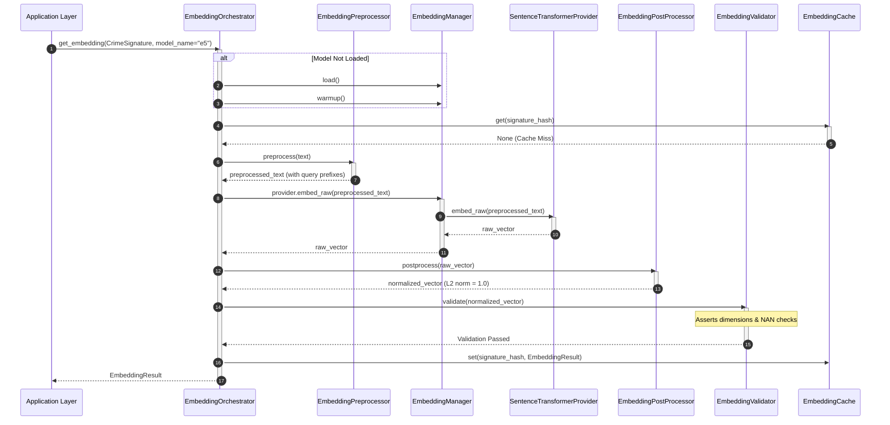

# ML Embedding Engine Framework

This package contains the pluggable, production-grade **Embedding Engine Framework** for CrimeLens AI. It refines raw inputs, routes them to model lifecycle executors, normalizes them, and produces L2-normalized float coordinates.

---

## 1. Architectural Pipeline Diagram

The diagram below details the decoupled pipeline processing stages and lifecycle components:

```
                      [ CrimeSignature ]
                              │
                              ▼
                  ┌───────────────────────┐
                  │ EmbeddingOrchestrator │ ◄── [ registry.yaml ]
                  └───────────┬───────────┘
                              │
                              ▼
                  ┌───────────────────────┐
                  │ EmbeddingPreprocessor │ ──► (Appends prefix query text)
                  └───────────┬───────────┘
                              │
                              ▼
                  ┌───────────────────────┐
                  │   EmbeddingManager    │ ──► (Coordinates Load/Warmup/Inference)
                  └───────────┬───────────┘
                              │
                              ▼
                  ┌───────────────────────┐
                  │  EmbeddingProvider    │ (Strategy Pattern)
                  └───────────┬───────────┘
                              │
                              ▼
                  ┌───────────────────────┐
                  │ EmbeddingPostProcessor│ ──► (L2 Normalization)
                  └───────────┬───────────┘
                              │
                              ▼
                  ┌───────────────────────┐
                  │  EmbeddingValidator   │ ──► (NAN/Dimension validations)
                  └───────────┬───────────┘
                              │
                              ▼
                       [ Cache Check ]
                              │
                              ▼
                     [ EmbeddingResult ]
```

---

## 2. Sequence Diagram

The interaction sequence during a processed and validated embedding run:



---

## 3. Design Decisions & Architectural Log

### A. Modular Pipeline Stages (Preprocessor -> Postprocessor -> Validator)
Models like E5 require distinct query prefixes (`"query: "`), while BGE needs search prompts (`"Represent this sentence..."`). Post-inference normalizations or dimension boundaries differ by model type.
* **Refinement**: These concerns are isolated into single-responsibility processor classes (`EmbeddingPreprocessor`, `EmbeddingPostProcessor`, and `EmbeddingValidator`). This keeps the providers focused purely on forward pass calculations.

### B. Model Lifecycle Management (`EmbeddingManager`)
Instantiating large PyTorch models directly inside web frameworks causes memory fragmentation, crashes on Zoho Catalyst AppSail dynamic bounds, and delays on first user queries.
* **Refinement**: The `EmbeddingManager` coordinates state flags (`load`, `warmup`), runs warmups using dummy forward passes, queries active health checks, and frees memory via explicit unloads and Python `gc.collect()` collection.

### C. Decoupled Model Config File (`configs/models/registry.yaml`)
Instead of hardcoding profiles in python dictionaries:
* **Refinement**: Configs are stored inside [registry.yaml](file:///e:/desk/crimelens/backend/configs/models/registry.yaml), detailing active model pointers, provider mapping definitions, prefix strings, and L2 normalizations.
