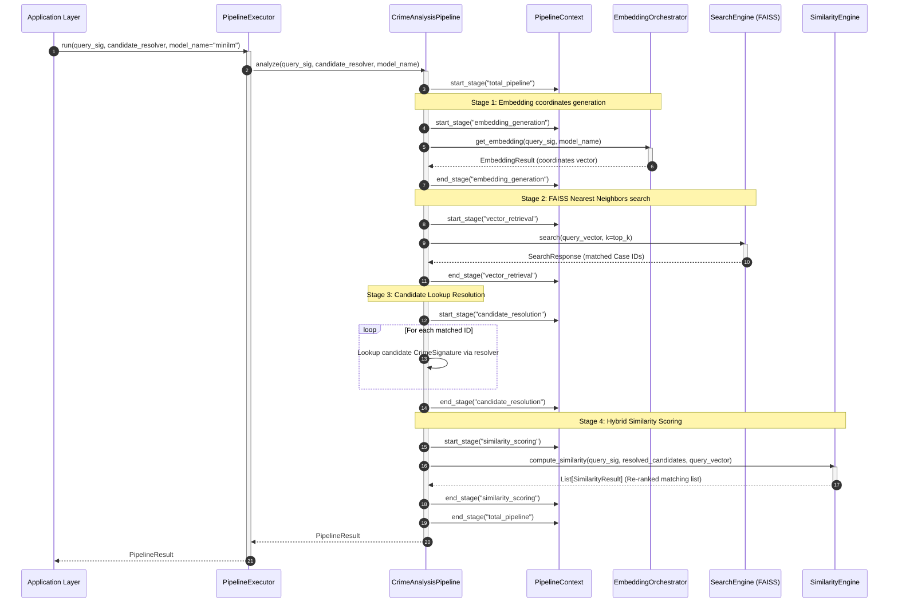

# Crime Analysis Pipeline Orchestrator

The integrated end-to-end **Crime Analysis Pipeline** coordinates the Pluggable Embedding Framework, Vector Retrieval Engine (FAISS), and Hybrid Similarity Engine into one executable ML query flow.

---

## 1. Architectural Diagram

The diagram below details the unified execution flow of the CrimeLens AI pipeline:

```
                      [ CrimeSignature ]
                              │
                              ▼
                 ┌──────────────────────────┐
                 │   CrimeAnalysisPipeline  │
                 └────────────┬─────────────┘
                              │
                              ▼
            (Stage 1) [ EmbeddingOrchestrator ] ──► (Generate dense coordinates)
                              │
                              ▼
            (Stage 2) [ SearchEngine (FAISS)  ] ──► (Retrieve Top-K Case IDs)
                              │
                              ▼
            (Stage 3) [ Candidate Lookup      ] ──► (Lookup case signature maps)
                              │
                              ▼
            (Stage 4) [ SimilarityEngine      ] ──► (Run weighted comparisons)
                              │
                              ▼
                      [ PipelineResult ]
```

---

## 2. Sequence Diagram

The step-by-step sequencing during a crime analysis query run:



---

## 3. Design Decisions & Architectural Log

### A. End-to-End Orchestration decoupling
To maintain clean borders, the pipeline orchestrator operates without direct connections to external database connections or web routers (like FastAPI). It is structured as a pure-python ML flow that consumes a query signature, an abstract search engine, and a callable resolver representing a database or caching layer, returning structured metrics.

### B. Timing Context Profiles (`PipelineContext`)
Diagnosing model execution lag requires granular monitoring metrics. The pipeline context runs timing markers (`time.perf_counter()`) for every stage (Embedding, Retrieval, Resolution, and Similarity), detailing millisecond lag attributes. These timing indicators are compiled directly inside the final query results payload.

### C. Resolution warning mappings
If the search index references Case IDs that are absent in database tables, the executor handles this without crashing, logs warnings (e.g. `"Failed to resolve candidate signature details..."`), and maps these warnings to the response metadata block.
