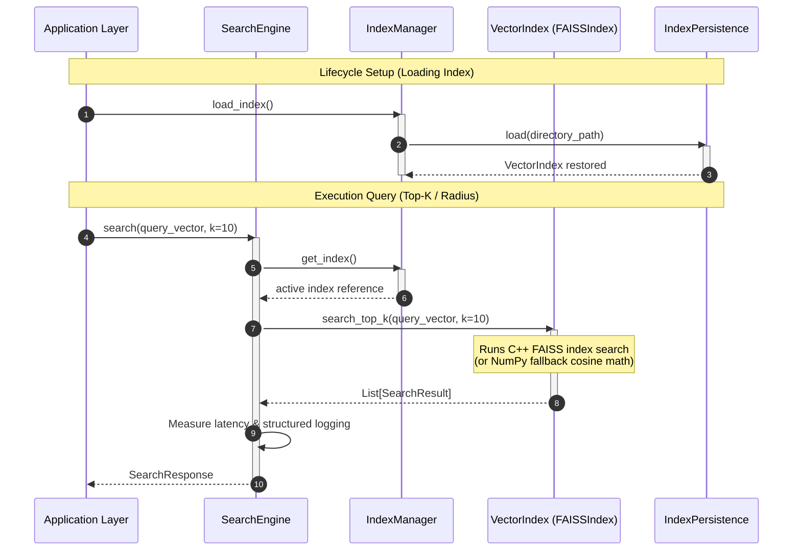

# Vector Retrieval System

The Vector Retrieval System maps high-dimensional vector coordinates (embeddings) generated from `CrimeSignature` inputs into indices and queries nearest neighbors under similarity metrics.

---

## 1. Architectural Diagram

The diagram below details the decoupled strategy pattern layout of the index database:

```
                        [ Query Vector ]
                               │
                               ▼
                        ┌──────────────┐
                        │ SearchEngine │ ◄── [ configs/retrieval.yaml ]
                        └──────┬───────┘
                               │
                               ▼
                        ┌──────────────┐
                        │ IndexManager │ ◄── [ IndexPersistence ]
                        └──────┬───────┘
                               │ Resolves Provider
                               ▼
                        ┌──────────────┐
                        │  VectorIndex │ (Strategy Pattern)
                        └──────┬───────┘
                               │
                ┌──────────────┴──────────────┐
                ▼                             ▼
         [ FAISSIndex ]               [ pgvector / pg ]
    (C++ Index / NumPy fallback)       (Future Strategy)
```

---

## 2. Sequence Diagram

The execution flow for an index serialization and query run:



---

## 3. Design Decisions & Architectural Log

### A. The Strategy Pattern (Provider Decoupling)
Downstream retrieval platforms evolve (e.g. from local memory index files to pgvector, Milvus, or ChromaDB cloud clusters). The abstract `VectorIndex` interface guarantees that all search operations are decoupled from backend dependencies. Adding a new database client requires implementing only the strategy methods.

### B. Unit-Normalized Cosine Similarity via Dot Product (IP)
FAISS lacks native Cosine Distance index structures. To perform Cosine queries, vectors are L2-normalized:
$$\mathbf{v}_{\text{norm}} = \frac{\mathbf{v}}{\|\mathbf{v}\|_2}$$
Dot products are then calculated via Inner Product (`faiss.IndexFlatIP`):
$$\mathbf{q}_{\text{norm}} \cdot \mathbf{v}_{\text{norm}} = \text{Cosine Similarity}$$
This yields mathematically exact Cosine metrics.

### C. Lightweight NumPy Fallback Search Engine
Compiling C++ FAISS wheels on Windows development machines or in lightweight CI/CD Docker containers often triggers build errors. The `FAISSIndex` class implements a complete fallback search engine using NumPy vector math. It yields identical rankings, allows local testing to run out-of-the-box, and automatically shifts to real FAISS when the library is loaded.

### D. Secure Metadata Separation
Vector search engines (like FAISS) excel at mapping float coordinates to integer IDs but lack structured document persistence. We isolate vector indexing from document mapping:
1. FAISS binaries are serialized to `index.bin`.
2. Python Pydantic `CrimeMetadata` dictionaries are mapped securely to integer offsets and written to `metadata.json`.
This allows metadata changes without retraining/rebuilding FAISS vector indices.
