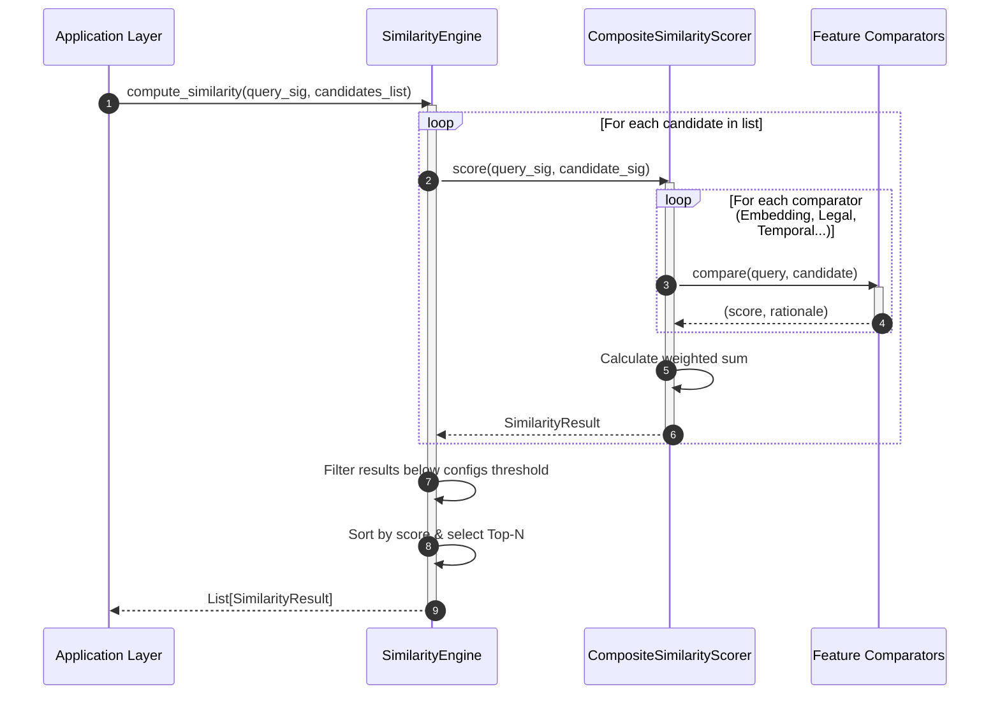

# Hybrid Crime Similarity Engine

The Hybrid Crime Similarity Engine executes second-stage re-ranking of candidate cases by analyzing dense vectors alongside structured spatial, temporal, legal, and behavioral metadata dimensions.

---

## 1. Architectural Diagram

The diagram below details the re-ranking layout of the Similarity Engine:

```
                    [ Candidate Crimes List ]
                                │
                                ▼
                       ┌──────────────────┐
                       │ SimilarityEngine │ ◄── [ configs/similarity.yaml ]
                       └────────┬─────────┘
                                │
                                ▼
                   ┌──────────────────────────┐
                   │    SimilarityScorer      │
                   └────────────┬─────────────┘
                                │ Runs comparators
                                ▼
                ┌────────────────────────────────┐
                ▼                                ▼
       [ Math Comparators ]             [ Metadata Comparators ]
       - Embedding (Cosine)             - Crime Head/SubHead
       - Temporal (Cyclical Cosine)     - Legal (Jaccard Sections)
       - Spatial (Geohash Prefixes)     - Behavior (Jaccard MO)
                                │
                                ▼
                    ┌─────────────────────────┐
                    │ Composite Scorer Sum    │ ──► (Normalize weights)
                    └───────────┬─────────────┘
                                │
                                ▼
                     [ SimilarityResult ]
```

---

## 2. Sequence Diagram

The interaction sequence during a candidate list comparison scoring and filter run:



---

## 3. Design Decisions & Architectural Log

### A. Second-Stage Composite Re-ranking
Semantic vector similarity indexes excel at finding broad candidate listings (Top 100) but cannot resolve legal statutory combinations or Modus Operandi matches. This module scores structured categories (Crime Head), statutory sections (Legal Jaccard index), cyclical hours, spatial grid blocks, and behavioral traits (MO tags), returning a final ranking.

### B. Trigonometric Temporal Comparators
Hour values (e.g. `23:59` and `00:01`) are mathematically adjacent but linear difference calculations label them as opposing limits. Trigonometric day/hour representations are compared using dot products, mapping adjacency on circles directly to proximity scores $\in [0.0, 1.0]$.
$$S_{\text{hour}} = \frac{1 + (\sin \theta_1 \sin \theta_2 + \cos \theta_1 \cos \theta_2)}{2}$$

### C. Geohash grid prefix overlays
Haversine geographical calculations are intensive. Comparing geohash character prefix matches (e.g. matching `tdr1wgd` and `tdr1wgc` yields 6 of 7 chars matching) provides a fast, lightweight estimate of nested spatial cells.

### D. Multi-layer Jaccard sets comparisons
Statutory section listings (e.g. `['IPC_379', 'IPC_34']`) and Modus Operandi keyword tags (e.g. `['relay_bypass', 'keyless_frequency']`) are compared using Jaccard index calculations:
$$\text{Jaccard}(A, B) = \frac{|A \cap B|}{|A \cup B|}$$
This ensures comparison regardless of section listing sort orders.
