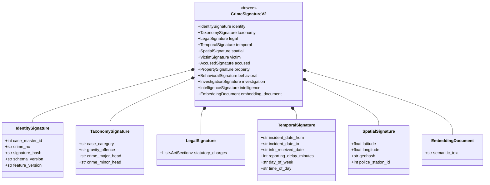

# CrimeLens AI — Crime Signature Engine v2

The **Crime Signature Engine v2** represents the foundational data structure redesign of the CrimeLens AI platform. It transitions the canonical `CrimeSignature` from a flat, partially structured model into an **immutable, deeply nested, cryptographic structure** derived directly from the Karnataka Police FIR Schema.

## Design Philosophy
1. **Immutability**: Once an `IngestedCase` is transformed into a `CrimeSignatureV2`, it is frozen. No downstream service can alter it.
2. **Decoupled Signatures**: The structure is divided into 12 logical sub-signatures (Taxonomy, Temporal, Spatial, Legal, Victim, Accused, Property, Behavioral, Investigation, Intelligence, Identity, and the Semantic Document).
3. **Traceability**: Every signature possesses a deterministic `signature_hash` computed over its unique identifiers and textual extraction.
4. **Semantic Embedding Target**: Instead of raw NLP parsing at the retrieval stage, the Builder explicitly constructs a human-readable `EmbeddingDocument` string incorporating the structured dimensions (Time, Space, Law, Taxonomy, MO) to optimize dense vector space indexing.

## UML Class Diagram

